# 3DSG-Generation-Datasets

This repository contains a suite of 3D Scene Graph (3DSG) datasets designed for graph generation conditioned on plane information. These datasets facilitate research into graph generation techniques and are structured with incremental complexity through multiple hierarchy levels, from walls and rooms to buildings and cities.

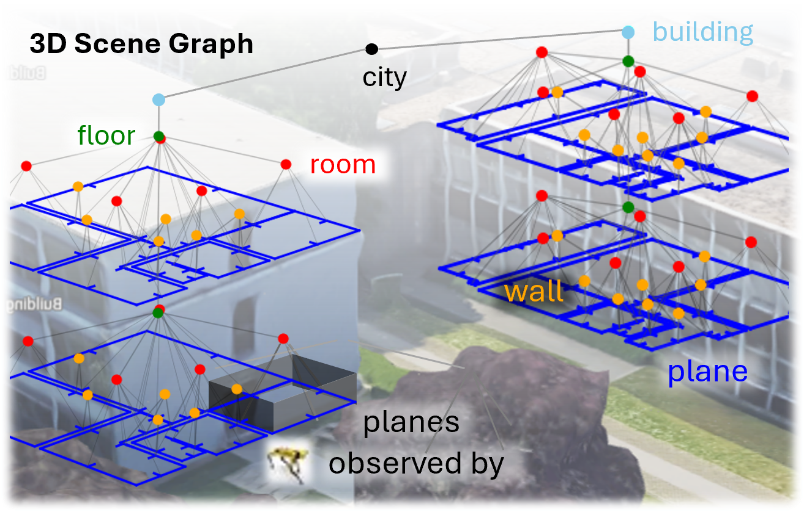

The datasets are divided into three sources: Synthetic data (S), MSD public dataset (M), and real LIDAR data (R). Each dataset is available in different hierarchy levels, with corresponding naming conventions to indicate the depth of the hierarchy.

---

## Dataset Structure

The 3DSG datasets are organized into `.zip` files, each containing an array of NetworkX graphs. The files are categorized by source and hierarchy level, as follows:

- **Synthetic Data (S)**: Simulated data generated for controlled environments and varied scenarios.
- **MSD Dataset (M)**: Public dataset ([link](https://github.com/caspervanengelenburg/msd)) containing real-world data with structured layout.
- **Real LIDAR Data (R)**: Data captured from real-world LIDAR sensors for authentic scene reconstruction.

### Hierarchy Levels
The datasets include different levels of hierarchical complexity:

- **-F**: Up to the **Floor** level (walls, rooms, etc.)
- **-B**: Up to the **Building** level (floors, rooms, walls)
- **-C**: Up to the **City** level (buildings, streets, city blocks)

Each `.zip` file contains a set of NetworkX graphs that represent the structure of the environment at the corresponding hierarchy level.

---

## Usage

You can download the dataset by accessing the individual `.zip` files categorized by source and hierarchy level. The datasets are designed for easy integration into graph-based generation models, and each file contains the necessary structure for graph generation research.

For example:

```python
import networkx as nx
import zipfile

with zipfile.ZipFile('S-F.zip', 'r') as zip_ref:
    zip_ref.extractall('dataset/')
    
graph = nx.read_gpickle('dataset/graph.gpickle')

```

## Benchmarks

We provide example images of the 3DSGs generated by all the compared methods, which can be found in the **benchmark** folder.

The current benchmarking for all the assessed metrics can be found in these tables:

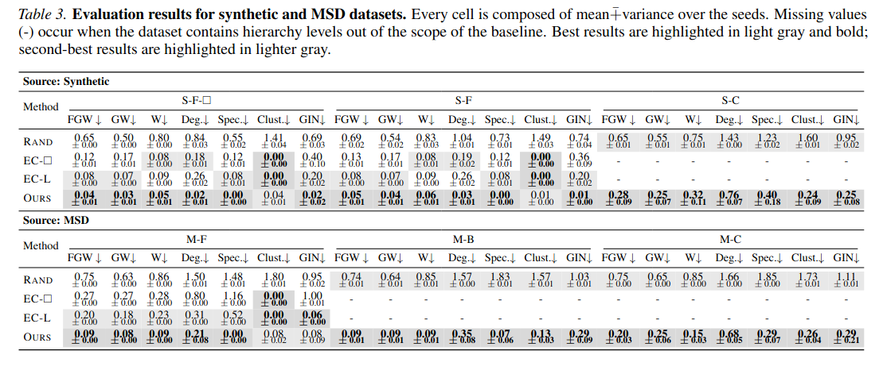

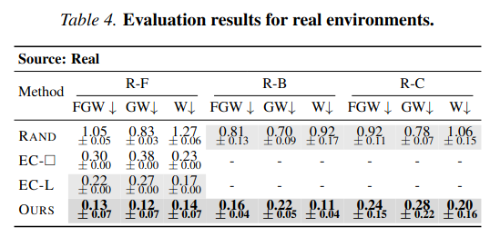

### Comparison Images

Detailed comparison images for each dataset and hierarchy level are available in the `comparison_images/` folder:

| Dataset | Hierarchy Level | Comparison Image |
|---------|----------------|------------------|
| Synthetic (S) | Floor (F) | [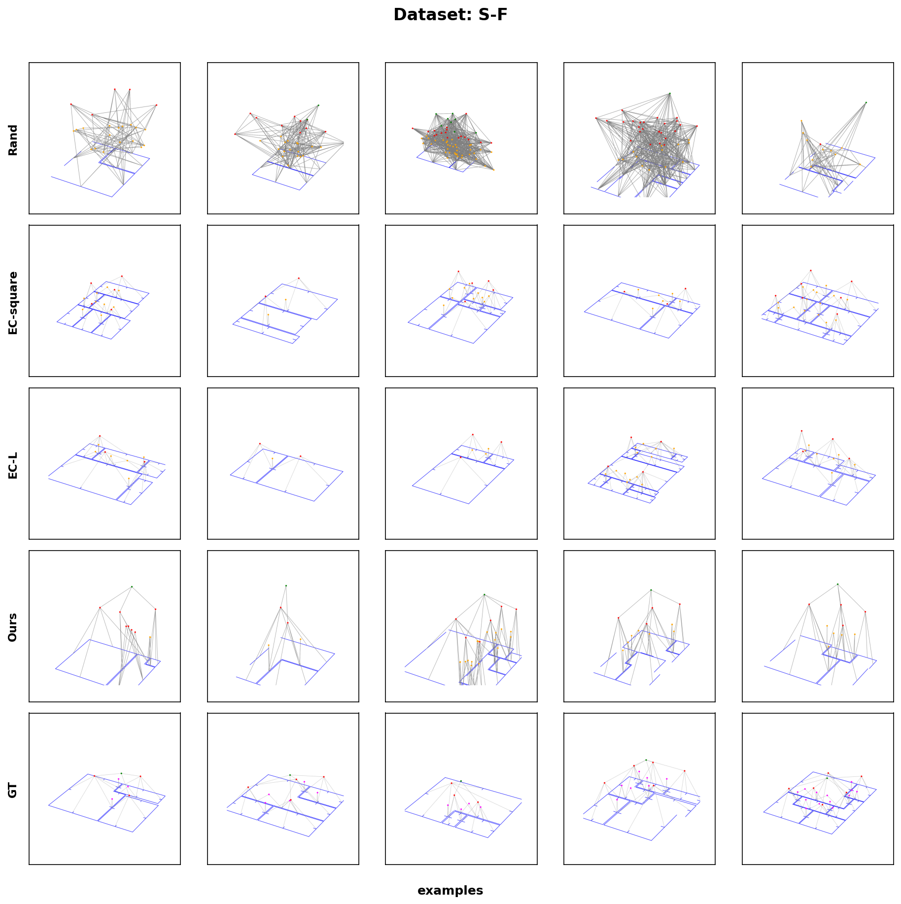](comparison_images/S-F_comparison.png) |
| Synthetic (S) | Floor (F) Square | [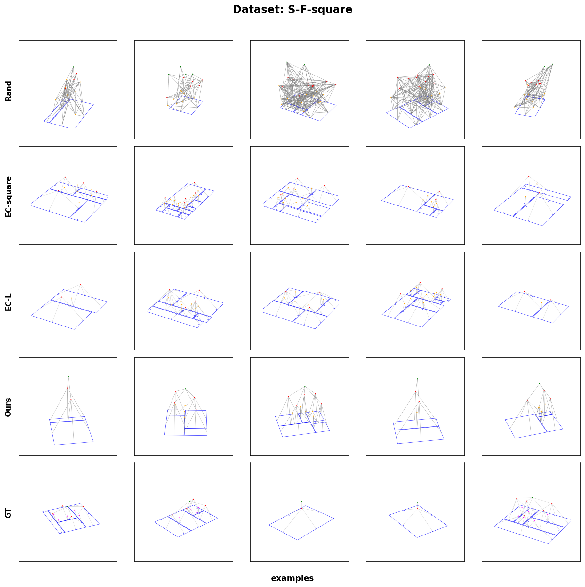](comparison_images/S-F-square_comparison.png) |
| Synthetic (S) | City (C) | [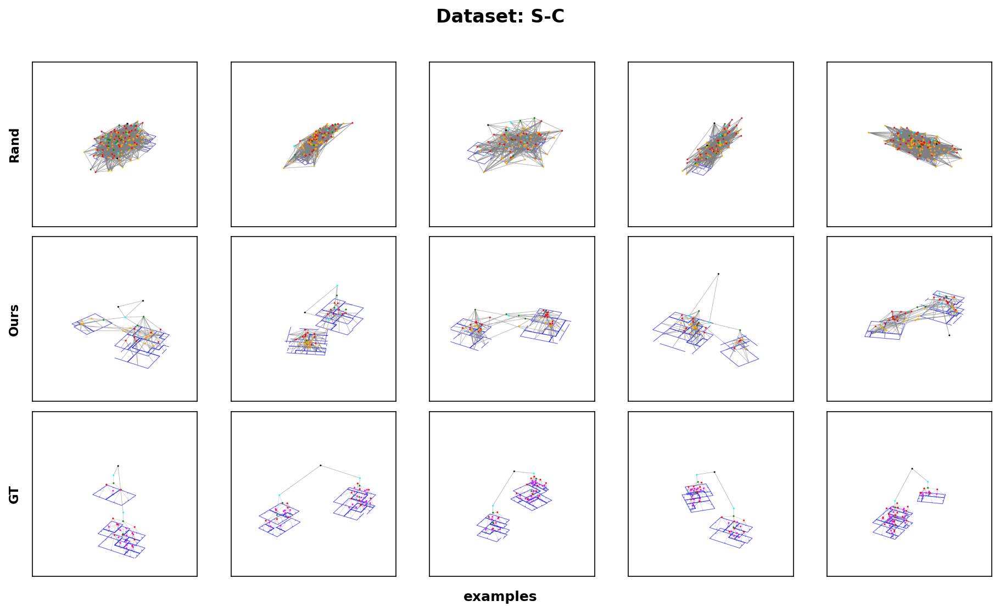](comparison_images/S-C_comparison.png) |
| MSD (M) | Floor (F) | [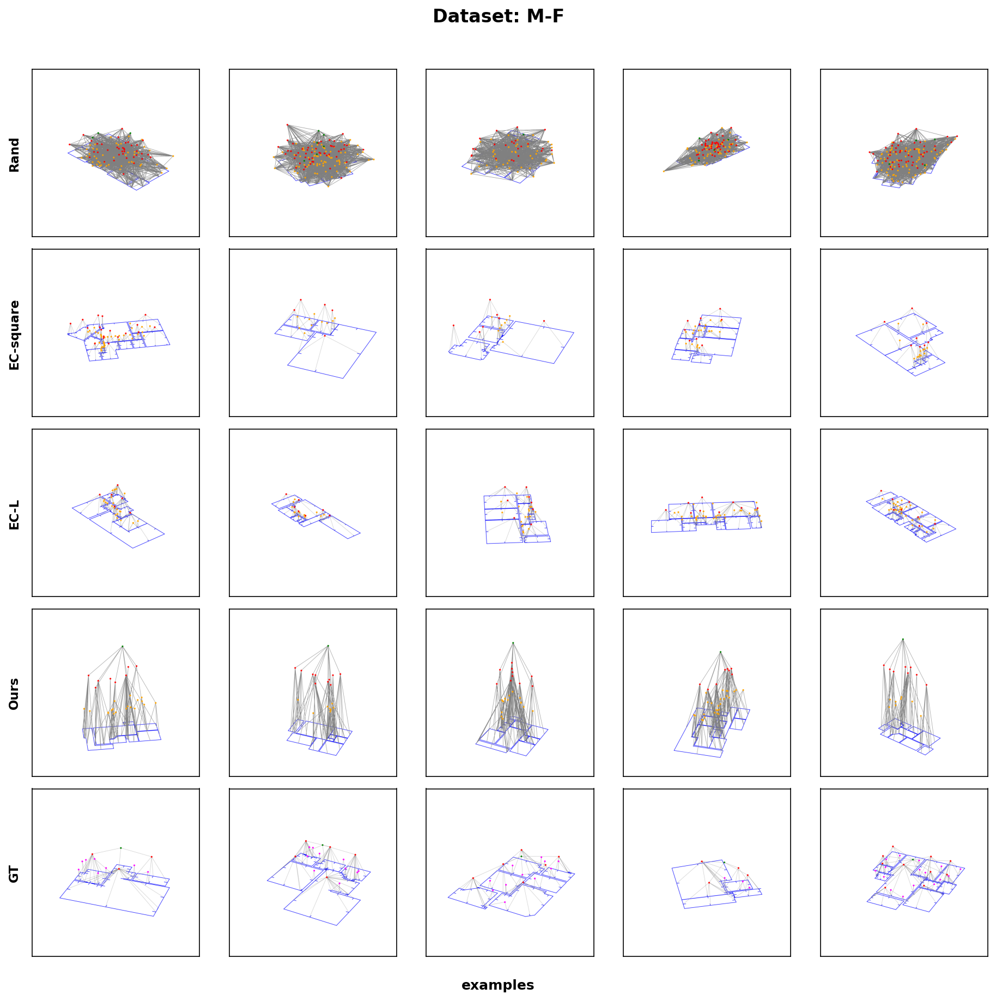](comparison_images/M-F_comparison.png) |
| MSD (M) | Building (B) | [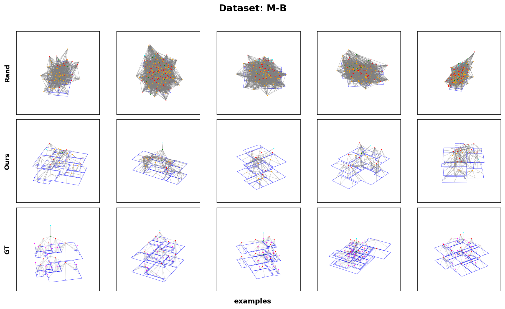](comparison_images/M-B_comparison.png) |
| MSD (M) | City (C) | [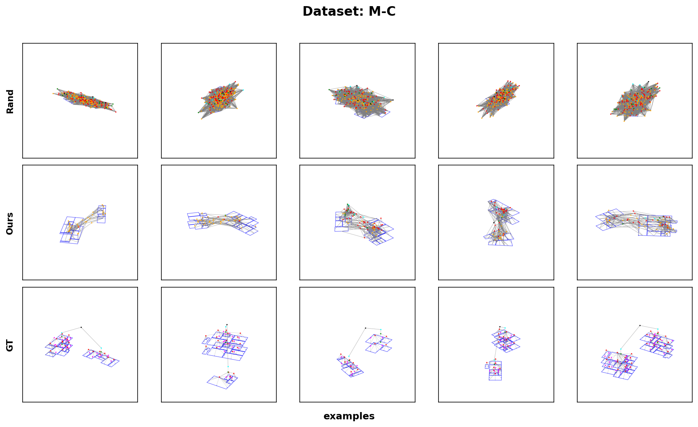](comparison_images/M-C_comparison.png) |
| Real LIDAR (R) | Floor (F) | [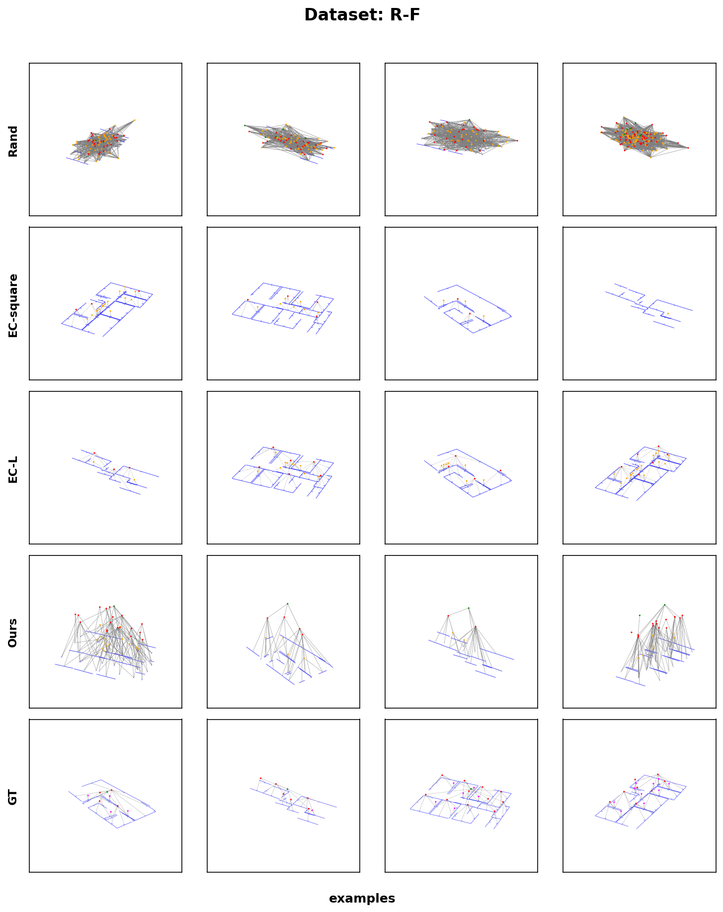](comparison_images/R-F_comparison.png) |
| Real LIDAR (R) | Building (B) | [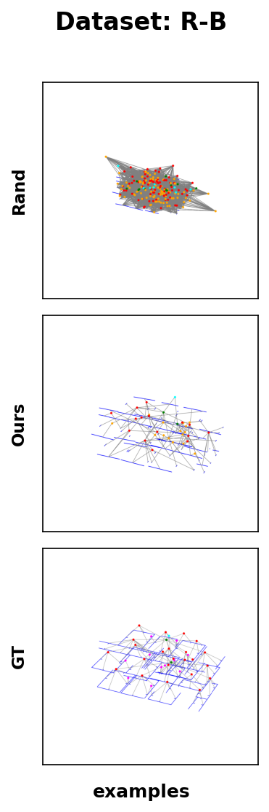](comparison_images/R-B_comparison.png) |
| Real LIDAR (R) | City (C) | [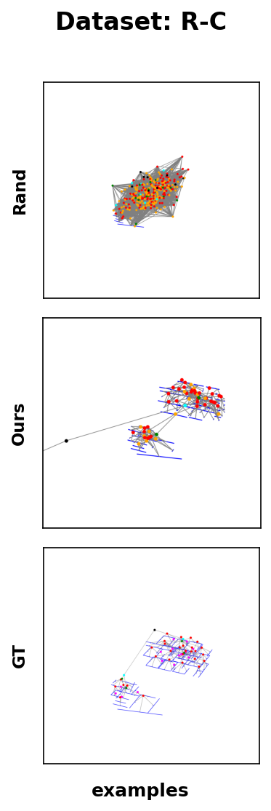](comparison_images/R-C_comparison.png) |

## Our Approach

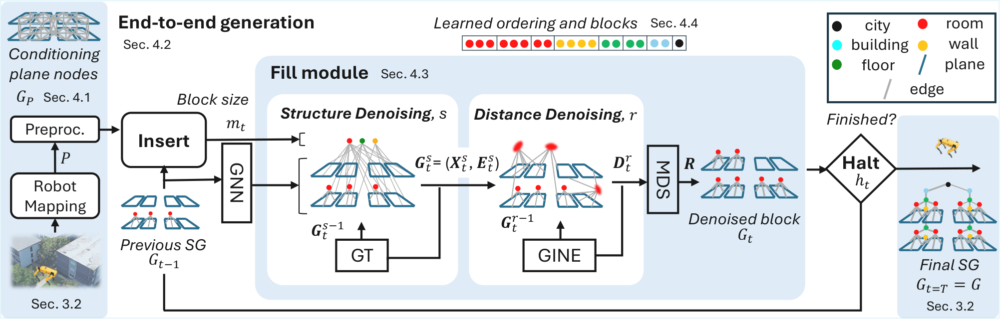

Our approach leverages a hierarchical graph generation framework that conditions on plane information to generate comprehensive 3D scene graphs. The architecture incorporates multiple levels of semantic understanding, from basic geometric primitives to complex spatial relationships.
